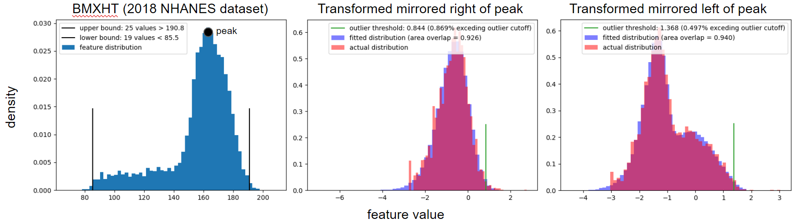
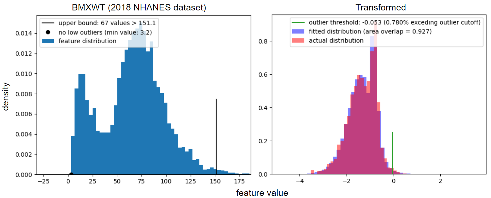
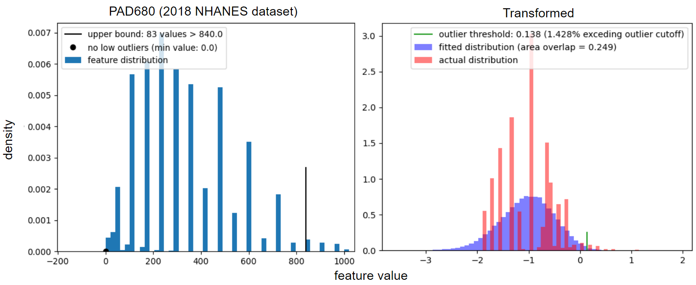

## About STAR_outliers :sun_with_face:

STAR_outliers (Skew and Tail-heaviness Adjusted Removal of outliers) is an open source python package that identifies univariate outliers relative to their distributions shapes. Univariate distributions are initially transformed as described in 'Outlier identification for skewed and/or heavy-tailed unimodal multivariate distributions'. Data transformed in this way often fits well to a four parameter tukey distribution, but not if the data is originally monotonic, highly skewed, multimodal, or discrete. STAR_outliers implements several modifications that robustly handle all of these cases.

STAR_outliers handles discreteness by replacing the original tukey parameter estimates (based on only 4 fixed quantiles) with quantile regression that considers quantiles 1 through 99 in intervals of 1, which robustly accounts for single scalars that occupy entire quantile ranges. We handle monotonic data by mirroring the distribution accross the broad side prior to transforming it, and we handle skewed data by splitting it at the peak and treating each side as though it were nmonotonic. Finally, we handle multimodal data by fitting a bimodal tukey mixture model with a custom numerical EM algorithm. 

## Instructions to Installing STAR_outliers :hammer_and_wrench:

1. [Install conda](https://docs.conda.io/en/latest/miniconda.html) if you haven't already installed either Anaconda or Miniconda
2. Open your conda terminal. 
3. Enter ```conda create --name outliers python=3.7``` in the terminal to create a new environment called outliers with python version 3.7]
4. Enter ```conda activate outliers``` in the terminal to enter your new environment. If that doesn't work, enter ```source activate outliers```
5. Enter ```conda install -c conda-forge matplotlib```
6. Enter ```pip install STAR-outliers```
7. Run ```python -m STAR_outliers --input file_name.txt``` to remove univariate outliers from every column.
8. If one column is a sample index, then specify that with ```path -m STAR_outliers --input file_name.txt --index index_name```

## Input :turkey:

  * `file_name.txt`: A tab-delimited numeric datafile with continuous or discrete data columns (named "file_name.txt" in this example). Missing values are allowed. Each feature must have ten unique values in order to remove outliers. 

## Output :poultry_leg:

  * `file_name_cleaned_data.txt`: A tab-delimited numeric datafile. Detected outliers are replaced with missing values. It is otherwise equivalent to 
file_name.txt. 
  * `file_name_outlier_info.txt`: the first column contains the column names from file_name.txt. Successive columns contain respective values for the percentage of non-outlier values,	the minimum feature value,	the low outlier cutoff value, the dataset	median, the high outlier cutoff value, and the	maximum feature value.
  * `file_name_all_fits.txt`: Contains the percentage of the dataset's histogram that overlaps with the fitted tukey's histogram. All values above 0.9 are good. Values will be below 0.9 if the data is discrete (because the fitted tukey is continuous), but the fit may still be good if the outlier cutoff looks appropriate. 
  * `file_name_outlier_plots`: histograms displaying the distributions with their fitted tukeys. Red is the real data, blue is the fitted model, and maroon is the overlapping region. 
  * `file_name_outlier_plots_untransformed`: histograms displaying the untransformed data along with the lower and upper outlier bound cutoffs. 

## Examples





## Repository structure

### Folders in the repository :file_cabinet:

  * `test_units`: contains code that confirms that many of the main functions work correctly both together and individually. 
  * `images`: contains examples of how STAR_outliers can effectively fit unusually shaped distributions. 

### Files :file_folder:

  * `STAR_outliers.py`: the main file that runs the algorithm
  * `STAR_outliers_library.py`: primary functions for tukey transformation and fitting
  * `STAR_outliers_plotting_library.py`: functions used for generating outlier plots
  * `STAR_outliers_polishing_library.py`: functions used to remove large spikes from distributions, making sure that a large number of points are not exactly equal to the median, and approximating quantiles for initial parameter estimates prior to quantile regression. 
  * `STAR_outliers_testing_library.py`: functions used to test each scalar distribution for monotonicity and multimodality. Functions are also used to split datasets at the peak and for mirroring monotonic data.
  * `setup.py` and `_init_.py`: allows STAR_outliers to be installed with pip
  * `all_2018_processed.txt`: a curated NHANES 2018 dataset. Curation namely involved transforming categorical variables into binary encodings. Used as input for the testing code in `unit_tests`
  * `requirements.txt`: lists STAR_outliers' dependencies
  
## Contributing :thumbsup:
If you find any bugs or have any suggestions/questions, please feel free to [post an issue](https://github.com/EpistasisLab/STAR_outliers/issues/new)! 
Thanks for your support!

## License
MIT + file LICENSE
